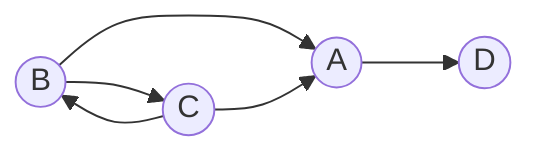


# 2017秋季博弈论课程笔记
`日期：2017.12.26`

您好！这是一篇用`Markdown`整理的课堂笔记，课程是2017年秋季的**博弈论**课程。用`Markdown`的原因是它轻量简洁，利于分享和展示，同时作者也想练习相关语法，希望您会喜欢`:)`

## 第一节 策略型博弈

#### 1.什么是博弈？

博弈是一种竞争、对抗或者合作的行为。维基百科解释为：
>  具有竞争或对抗性质的行为称为博弈行为。在这类行为中，参加斗争或竞争的各方各自具有不同的目标或利益。为了达到各自的目标和利益，各方必须考虑对手的各种可能的行动方案，并力图选取对自己最为有利或最为合理的方案。比如日常生活中的下棋，打牌等。博弈论就是研究博弈行为中斗争各方是否存在着最合理的行为方案，以及如何找到这个合理的行为方案的数学理论和方法。

#### 2.博弈论的三要素：**局中人、策略、支付函数**
#### 3. 博弈论的鼻祖：**孙膑**
#### 4.策略型博弈是一个三元组 $τ=(N,{S_i },{R_i })$，其中$N$表示局中人集，${S_i }$表示策略集，${R_i }$表示支付函数集。
#### 5.特殊的博弈类型：
> **1. 有限博弈：**
> - 博弈中局中人人数有限
> - 每个局中只有有限个策略
> 
> **2. 零和博弈：**
>  - 所有局中人所获支付之和为零，即一方所得为另一方所失

#### 6.囚徒困境
> 局中人：甲、乙
> 
> 策略：$S_1=S_2=${交代，不交代}
> 
> 支付函数：支付矩阵
> 
>|  | 乙交代 |  乙不交代|
>|--|--|--|--|
>| 甲交代 | 10,10 |0,20|
>|甲不交代|20,0|2,2|

**分析**：若甲乙都不交代，俩都都判2年；甲乙都交代，都判10年；一个交代而另一个交代，前者直接释放，后者判20年。囚徒困境的难处在于，无论对方的策略是什么，本方选择交代，利益才最大——这会导致两人都交代的结果各判10年。但显然这个结果不是最优的，最优的情况是两人都不交代。

#### 7.田忌赛马

田忌赛马的故事大家都耳熟能详，是中国历史上有名的揭示如何善用自己的长处去对付对手的短处，从而在竞技中获胜的事例。主要讲述了齐国的大将田忌与齐威王进行赛马比赛反败为胜的故事。
博弈矩阵为：
|   | 田忌上中下 | 上下中 | 中上下 | 中下上 | 下上中 | 下中上 |
|--|--|--|--|--|--|--|
| 齐王上中下 | 3,-3 | 1,-1 | 1,-1 | 1,-1 | -1,1 | 1,-1 |
| 上下中 | 1,-1 | 3,-3 | 1,-1 | 1,-1 | 1,-1 | -1,1 |
| 中上下 | 1,-1 | -1,1 | 3,-3 | 1,-1 | 1,-1 | 1,-1 |
| 中下上 | -1,1 | 1,-1 | 1,-1 | 3,-3 | 1,-1 | 1,-1 |
| 下上中 | 1,-1 | 1,-1 | 1,-1 | -1,1 | 3,-3 | 1,-1 |
| 下中上 | 1,-1 | 1,-1 | -1,1 | 1,-1 | 1,-1 | 3,-3 |

#### 8.纳什均衡
思想：双赢、多赢

博弈的纳什均衡是这样一种最优策略组合，是一种你好、我好大家都好的理性结局，其中每一个局中人均不能也不想单方面改变自己的策略而增加收益，每个局中人选择的策略是对其他局中人所选策略的最佳反应。

## 第二节 展开型博弈

#### 1.什么是展开型博弈？
这个定义通过一个树的形式给定。在树的每一个节点（vertex），不同的参与者选择一个边（edge）。博弈的展开式所包含的信息和内容:
1. 参与人的集合，记为i=1,2,…n,用N代表虚拟的参与人“自然”；
2.  行动的次序，即谁在什么时候行动；
3. 参与人的行动空间，即轮到某参与人行动时，他从该时刻的纯策略空间中选取什么策略；
4. 当参与人作出他们的行动决策时，他所观测到或他所了解到的信息，即他在此时获得的信息集合；
5. 参与人的得益(支付或效用)，它们是已知行动的函数；
6. 在任何外生事件的概率分布。

## 第三讲 有向图

#### 1.有向图（directed graph digraphs）概念:
一个图看起来是由一些小圆点（称为顶点或结点）和连结这些圆点的直线或曲线（称为边）组成的。如果给图的每条边规定一个方向，那么得到的图称为有向图，其边也称为有向边。在有向图中，与一个节点相关联的边有出边和入边之分，而与一个有向边关联的两个点也有始点和终点之分，如图：

对于上图 ，出度：$sum_(d_A^+ (u))=1$，入度：$d_A^- (u)=2$

若是无向图，A的度为：$d_A^+ (u)=3$

#### 2.整体规律
对于有向图 $D=(V,A)$，如下规律：

- $\Sigma(d^+(u))=\Sigma(d^-(u))$ 即入度和等于出度和
- $\Sigma(d^+ (u)) +\Sigma(d^- (u))=2|A(D)|$ 即入度与出度之和为边数的2倍，因为每条边都贡献了一个入度和一个出度

#### 3.度对序列
>$(d_i^+)_1^n=(d_1^+,d_2^+,…,d_n^+)$
>
>$(d_i^-)_1^n=(d_1^-,d_2^-,…,d_n^-)$

$(d_i^+ )_1^n,(d_i^- )_1^n$<==>有向图，充要条件为$(d_i^+ )_1^n=(d_i^- )_1^n$

#### 4.竞赛图
- 竞赛图是通过在无向完整图中为每个边缘分配方向而获得的有向图（有向图）。 也就是说，它是一个完整图形的方向，等价于一个有向图，其中每对不同的顶点通过单个有向边连接，即每对顶点之间都有一条边相连的有向图称为竞赛图
- 竞赛图一定存在一个排名

#### 5.关于博弈论学科
- 这门学科应用背景强，方法杂，应用广
- 随着网络变化，更新快，动手强，没有系统理论
- 年轻人容易出名，因为一个问题一个方法

## 第四讲 博弈论的分类

#### 1.数学分法

- 矩阵博弈
- 博弈树
- 微分博弈

#### 2.按局中人数量

- 二人博弈
- 多人博弈

#### 3.按策略

- 有限策略
- 无限策略

#### 4. 支付函数

- 零和博弈
- 常和博弈

#### 5.按局中人关系

- 合作
- 非合作

#### 6.按时间

- 静态博弈
- 动态博弈

#### 7.按应用

- 政治博弈
- 经济博弈
- 人与自然
- **人生规划**

#### 8.博弈模型

- 田忌赛马
- **囚徒困境**
- 智猪博弈
- 斗鸡博弈
- 猪鹿博弈

>考题：建立一个有趣的、基于现实的博弈模型

## 第五讲 矩阵博弈

#### 1.矩阵博弈的性质

设$τ$是一个二人零和博弈，有限对策N=｛甲，乙｝，$S_1={α_1,α_2,α_3,α_4,…,α_n}$ ,
$S_2={β_1,β_2,…,β_n}$ 

- 甲在局势($α_i,β_i)$对应的支付函数为$a_{ij}$.
令$A=(a_{ij})_{m*n}=\begin{bmatrix}
   a_{11} & ...&a_{1n}\\
   ...&...&... \\
   a_{n1} & ...&a_{nn}
\end{bmatrix}$

- 乙在局势$(α_i,β_i)$对应的支付函数为$b_ij$.
令$B=(b_{ij})_{m*n}=\begin{bmatrix}
   b_{11} & ...&b_{1n}\\
   ...&...&... \\
   b_{n1} & ...&b_{nn}
\end{bmatrix}$

由于是二人零和博弈，则$a_{ij}+b_{ij}=0,i=1,…,m,j=1,…,n$.从而可以得出 $A=-B$.

$τ=(N,{S_1,S_2 },A)$简记为$τ=(S_1,S_2,A)$，称为矩阵对弈。

#### 2.特点

- 一个人的获得是另一个人的失去
- 完全对抗竞争博弈模型
- 非合作型

#### 3.分析
对甲而言，$α_i$至少可以获得支付$p_i$：
$p_i = min\{a_{i1},a_{i2},a_{i3},...,a_{i1}\}= min_{1\le j\le n}a_{ij}$

则$α_i^*=max_{{1\le i \le m}}p_i=max_{{1\le i \le m}}min_{1\le j\le n}a_{ij}$

对乙而言，$q_i$：
$q_i = max\{a_{1j},a_{2}j,a_{3j},...,a_{mj}\}= max_{1\le j\le m}a_{ij}$

则$β_j^*=min_{{1\le i \le m}}q_i=min_{{1\le i \le n}}max_{1\le j\le m}a_{ij}$

#### 4. 引理

$1\le i \le m,1\le j \le n,max(min(a_{ij}))\le min(max(a_{ij}))$

$(α_i,β_i )$满足$a_{i^* j}\le a_{i^* j^*}\le a_{{ij}^* }$

## 第六讲 矩阵博弈

####  1.囚徒困境-->囚徒义境

> **问题背景：**
>
>两位嫌疑犯甲、乙因盗窃被警官A抓住，同时发现房东太太死亡，但无证据表明死因与甲乙有关。于是聪明的A审讯二位，提出如下支付矩阵，但A不知道甲是张飞，乙是关羽；甲乙不得通信.
>
> **支付矩阵:**
> 
>|  | 乙交代 |  乙不交代|
>|--|--|--|--|
>| 甲交代 | 10,10 |0,20|
>|甲不交代|20,0|2,2|
>

成功将“困境”转化为“义境”

#### 2.矩阵对策  
$τ=(S_1,S_2,A),|S_1 |=m\ge 2,|S_2 |=n\ge 2.$ 每个$(α_i,β_i )$形成局势

最优策略为：$(α_(i^* ),β_(j^* ))$, 其中$α_{i^* }$可以看作坏人里的好人，$β_{j^* }$可以看作好人中的坏人

#### 3.定理
$max(min(a_{ij}))=min(max(a_{ij}))$当且仅当$\exists (α_{i^*},β_{j^*} )$使得$a_{ij}^*\le a_{i^* j^* }\le a_{i^* j}$

## 第七讲

#### 1.复习
矩阵对策为：$τ=(S_1,S_2,A),|S_1 |=m\ge 2,|S_2 |=n\ge 2$

#### 2.智猪博弈
猪圈里有一大一小两头猪，猪圈一头有石槽，另一头有一个踏板，与石槽相邻的是猪食库，而踏板控制着猪食的供应。踏一下板，有q个单位猪食进槽，但需要支付c个单位成本（即猪食）:

- 如果小猪踩踏板，则大猪等到小猪跑到食槽时，开始与小猪一起吃。大猪吃了s个单位，小猪吃了q-s个单位。
- 如果大猪踩踏板，则小猪等到大猪到食槽时开吃，大猪吃了b个单位，小猪吃了q-b个单位。
- 如果两猪都去踩踏板，则大猪吃了t个单位，小猪吃了q-t个单位
- 如果两猪都不去踩踏板，则谁也不吃

**支付矩阵为：**

|  | 小猪踩 | 小猪等待 |
|--|--|--|
| 大猪踩 | t-c,q-t-c | b-c,q-b |
| 大猪等待 | S,q-s-c | 0,0 |

**具备条件为：**

1.	即踩即喷公理
2.	有盖公理
3.	强成本公里：小猪独踩时，吃到的大于付出的成本
4.	小猪肯同踩公理：q-t-c>0
5.	跑速公理：大猪比小猪跑的快
6.	吃速公理：大猪比小猪吃得快。

## 第八讲 无盖智猪博弈

#### 1.无盖智猪博弈特点：

1. 按开关，支付c=2单位食物
2. 食槽的食量 q=10单位食
3. 即到即吃
4. 大猪等待，小猪踩开关，大猪可吃到9份，小猪1份
5. 小猪等待，大猪踩开关，小猪吃4份，大猪吃6份
6. 大猪小猪同时踩开关，大猪吃7份，小猪吃3份
7. 大猪小猪都不踩，则吃到0份。

**支付矩阵为：**

|  | 小猪踩 | 小猪等待 |
|--|--|--|
| 大猪踩 | （5,1） | （4,4） |
| 大猪等待 | （9，-1） | （0,0） |

#### 2.分析

1. 纳什均衡点：大猪踩，小猪等待
2. 无论大猪如何东奔西忙，小猪就是不动，搭便车理论
3. 大猪为了自己的利益，推动社会的进步繁荣

#### 3.其它

1. 智猪模型分为有盖和无盖
2. 对每类模型给出严格的精确的数学模型
3. 分析透，应用于现实
>现实中，例如手机行业，魅族缺乏核心竞争力，如果它自己独自研发则会入不敷出；如果高通这些顶端供应厂商研究，魅族直接使用，才可以生存下去。

## 第九讲 二人零和有限博弈

#### 1.定义
设$τ=(S_1,S_2,A)$是一个矩阵博弈，其中

$S_1={α_1,α_2,…,α_m},S_2={β_1,β_2,…,β_n},A=(	a_ij)_{m*n}$

$S_1^*=\{ X=(x_1,x_2,…,x_m ),x_i>0,x\in R^n,\sum_{i=1}^m x_i =1\}$

$S_2^*=\{ Y=(y_1,y_2,…,y_n ),y_i>0,x\in R^n,\sum_{i=1}^n y_i =1\}$

- $S_1^*$, $S_2^*$称为甲乙的混合策略集，简称策略集.
- $X\in S_1^*$,$Y\in S_2^*$称为甲乙的混合策略，简称策略.
- $(X,Y)$称为一个混合局势，称为局势
- $E(X,Y)$称为甲的期望支付函数，$E(X,Y)=XAY^T$
-  $τ^*=(S_1^*,S_2^*,E)$称为$τ$的扩充
- $τ$是$τ^*$的特款
- 纯策略$S_1,S_2$称为纯策略
- 从坏的条件下取优，$max\{ min_{1 \le i \le m}(a_{ij})\}$

#### 2.定理	
$τ^*=(S_1^*,S_2^*,E)$是有解的，即$max(minE(X,Y))=min(maxE(X,Y))$的充要条件是$\exists X^* \in S_1^*  ,Y^* \in S_2^*$, 使得对$\forall X\in S_1^*,\forall Y\in S_2^*$,有$E(X,Y^* )\le E(X^*,Y^* )\le E(X^*,Y)$

$X^*,Y^*$ 称为 $τ$ 的混合解，简称解$v_{τ^* }$, $v_{τ^*}=E(X^*,Y^* )$

$X^*$,$Y^*$分别称为甲乙的最优策略。

## 第十讲 博弈论的计算工具

#### 1.规划理论为：
- 线性规划
- 非线性规划：凸规划，非凸规划
- 证书规划

#### 2.什么是计算机？.

- 计算机 = 数学计算模型 + 实现材料
- 电子计算机 = 图灵机 + 实现材料
- 图灵机与中国珠算并无区别

#### 3.定理一：人类没有绝对通用的计算机

#### 4.定理二：图灵机的数目<= |N|

#### 5.计算机的类型
按照实现材料分为：

- 冯氏计算机： 图灵机 + 电子器件
- 量子计算机
- 生物计算机：DNA、RNA、蛋白质
- 神经网络计算机：前向、反馈

#### 6.探针计算机

- 探针的产生思想是：打开牢笼，解放数据，数据之间，任意处理
- 从理论上来说，图灵机的能力不等于探针机的能力：PMs=2^TMs,其中，PMs是探针机的数目，TMs是图灵机的数目。
- 分为DNA-Ⅰ型计算机和DNA-Ⅱ型计算机

## 第十一讲 线性规划

#### 1.定义
要最大化目标函数：$maxf=10x_1+15x_2+12x_3$
但是变量有线性约束条件：

$\begin{cases}
   1.2x_1+0.9x_2+1.1x_3  \le5400  \\
   0.7x_1+0.9x_2+0.6x_3  \le2800 \\
   0.9x_1+0.8x_2+x_3  \le3600 \\
   x_1,x_2,x_3 \ge 0 \\
\end{cases}$

约束条件可以写为：
$\begin{cases}
   AX \le b \\
   X \ge 0
\end{cases}.$

其中$A=\begin{bmatrix}
   1.2 & 0.9& 1.1\\
   0.7 & 0.9&0.6 \\
   0.9& 0.8& 1\\
\end{bmatrix}.$
$X=(x_1,x_2,x_3).$
$b=\begin{bmatrix}
   5400 \\
   2800 \\
   3600\\
\end{bmatrix}.$

#### 2.归纳出线性规划标准型
$minf=C^T X$

$\begin{cases}
   AX \le b \\
   X \ge 0
\end{cases}.$

#### 3.标准化问题
- max->min
- 松弛变量(剩余变量)：若所研究的线性规划模型的约束条件全是小于类型，那么可以通过标准化过程引入M个非负的松弛变量。

#### 4.标准型LP
约定$A=(a_{ij})_{m*n}, m \ge n.$ $rank(A)=m.$ 即A的秩为$m$

则 $A$必有一个子矩阵$B_{m*m}$, $|B| \ne 0$，使得$A=BN$

>**例:**
>
>$minf=-x_2+x_3.$
>
>$\begin{cases}x_1+3x_2+x_3=2   \\  x_2-3x_2+x_4=1 \\ x_2-x_3+x_5=2 \\  x_1,x_2,x_3,x_4,x_5 \ge 0 \\ \end{cases}$
>
>则$A=\begin{bmatrix}1&-2&1&0&0 \\ 0&1&-3&1&0 \\ 0& 1& -3 & 0 &1 \\ \end{bmatrix}.$ $B=\begin{bmatrix}1 & 0&0 \\ 0 & 1 &0 \\ 0& 0&1\end{bmatrix}.$ $N=\begin{bmatrix} -2& 1 \\ 1 & -3 \\ 1 & -1 \\ \end{bmatrix}.$
>
>则 $AX=b	\implies (B,N)\begin{pmatrix}X_B \\X_N \end {pmatrix}=b$
>$\implies BX_B+NX_N=b$
>$\implies X_B+B^(-1) NX_N=B^(-1) b$
>$\implies X_B=-B^(-1) NX_N+B^(-1) b$

对于上面的推导公式，$X_B$称为基本解，$X_N$为自由变量
$min(z)=(C_B  C_N )\begin{pmatrix}x_B \\x_N \end {pmatrix}=C_B X_B+C_N X_N$

-------
>文档地址：`https://github.com/Gooong/GameTheory-Class-Notes`
>
>编辑器： `https://stackedit.io/app`

